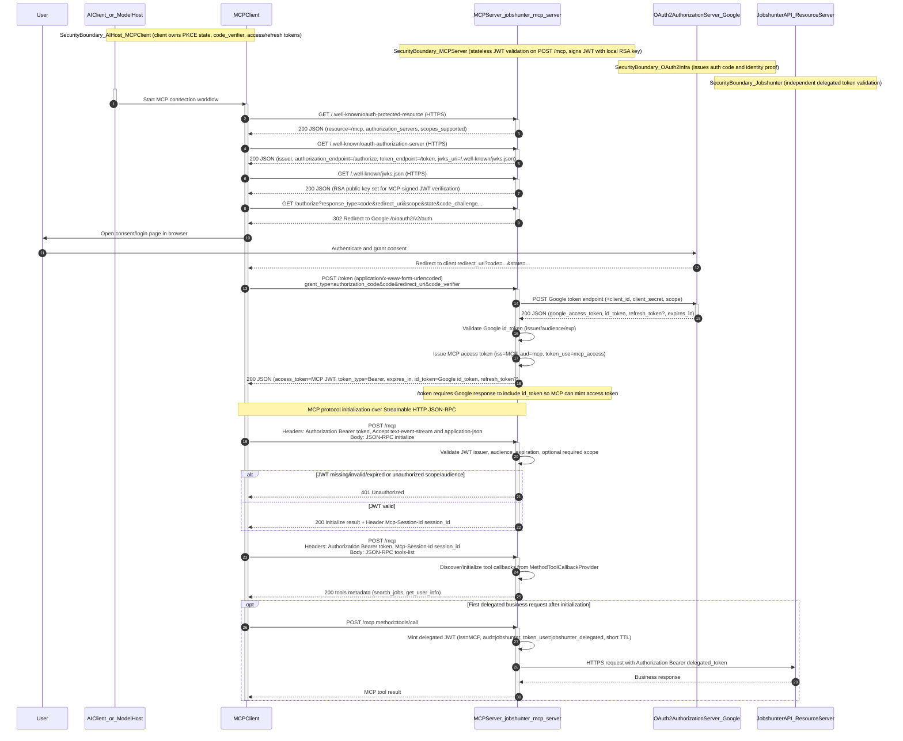

# MCP Server Authentication and Initialization Flow

The MCP server acts as both a protected MCP endpoint and a first-party Authorization Server. It uses Google only as upstream identity proof, mints its own `/mcp` bearer token, and mints a separate delegated token for Jobshunter.

Important security and architecture considerations:

- The server is stateless for OAuth sessions and token storage; the MCP client owns token lifecycle.
- `id_token` and `access_token` have distinct roles and are not rewritten.
- `Mcp-Session-Id` scopes protocol continuity, but authentication still depends on per-request bearer JWT.
- Delegated calls to Jobshunter use a dedicated short-lived JWT (`aud=jobshunter`) distinct from MCP bearer token.

Assumptions and unknowns (explicit):

- Spring AI internal JSON-RPC error envelope details are framework-managed and not fully specified by this repository.
- Refresh token behavior depends on upstream provider behavior and whether refreshed responses include `id_token`.
- Jobshunter-side JWT validation internals are external to this repository.
