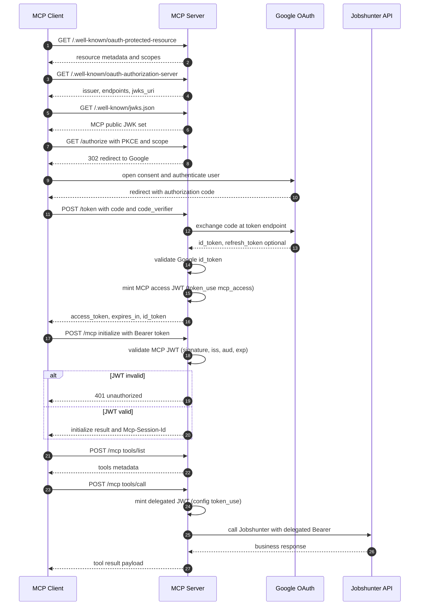

# MCP Server Authentication and Initialization Flow

The current implementation is internal-AS only: Google is used for identity proof, MCP mints its own access token for `/mcp`, and MCP mints a separate delegated token for Jobshunter calls.

Alignment with current code:
- `/mcp` authorization is `authenticated()` with issuer and audience checks from `mcp.authorization-server.*`.
- OAuth discovery metadata (`issuer`, `authorization_endpoint`, `token_endpoint`, `jwks_uri`, `resource`) is derived from the fixed `mcp.authorization-server.issuer` value.
- OAuth discovery metadata is not derived from `Host` or `X-Forwarded-*` request headers.
- No `required-scope` gate is applied on `/mcp`.
- Delegated token `token_use` is configurable via `mcp.authorization-server.jobshunter-delegated-token-use`.
