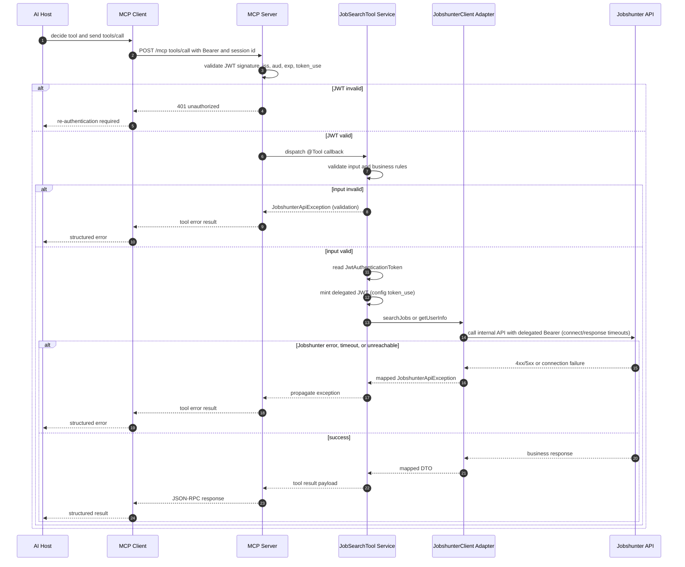

# MCP Tool Invocation Flow

This sequence reflects current code paths for `search_jobs` and `get_user_info`:

- MCP JWT validation checks signature, issuer, audience, and `token_use` (`McpSecurityConfig`) before any tool dispatches.
- `JobSearchTool` validates business rules up front — e.g. `search_jobs` requires at least one of `searchCompanies` or `searchWithUserPrompts` — and fails fast with a `JobshunterApiException` before any delegated call is made.
- Delegated token minting reads the caller's `JwtAuthenticationToken` from the security context and mints a short-lived Jobshunter-audience JWT via `DelegatedTokenResolver` / `McpTokenIssuer`.
- `JobshunterClient` calls the internal Jobshunter API through a `RestClient` configured with explicit connect/response timeouts and optional mutual TLS trust-store configuration (`RestClientConfig`, `JobshunterProperties.Ssl`).
- Adapter failures are normalized into `JobshunterApiException`: HTTP status codes are mapped per-range (400/401/403/404/5xx), timeouts are detected and reported distinctly, and a likely HTTP/HTTPS protocol mismatch against the configured base URL is called out explicitly to speed up misconfiguration diagnosis.
