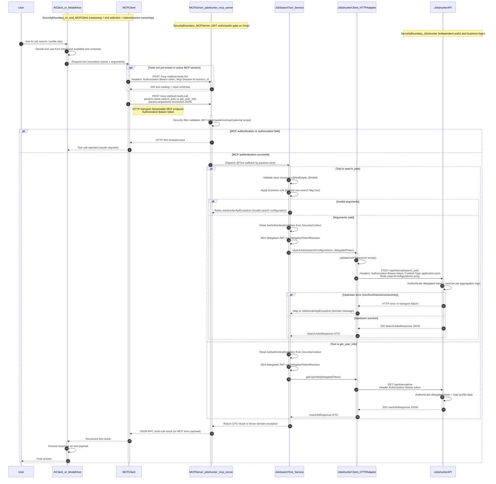

# MCP Tool Invocation Flow

This flow shows the full runtime chain from user intent to AI tool reasoning, MCP transport, server-side validation, delegated Jobshunter API calls, and final answer synthesis.

Important security and architecture considerations:
- Authorization is enforced twice by design: once at MCP ingress, then again by Jobshunter when delegated token is received.
- Tool argument validation combines schema-level constraints and business-level rules before upstream calls.
- Identity propagation is explicit via dedicated delegated JWT (`aud=jobshunter`, `token_use=jobshunter_delegated`).
- Error domains are separated: MCP auth failures return `401`, while upstream/service failures are mapped into tool-level exceptions.

Assumptions and unknowns (explicit):
- Exact JSON-RPC/MCP error envelope for uncaught runtime exceptions depends on Spring AI internals.
- AI host decision strategy for choosing tools is implementation-dependent and not defined by this repository.
- Jobshunter internal authorization rules for delegated tokens are external to this codebase.
